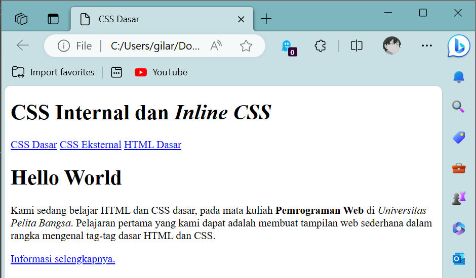
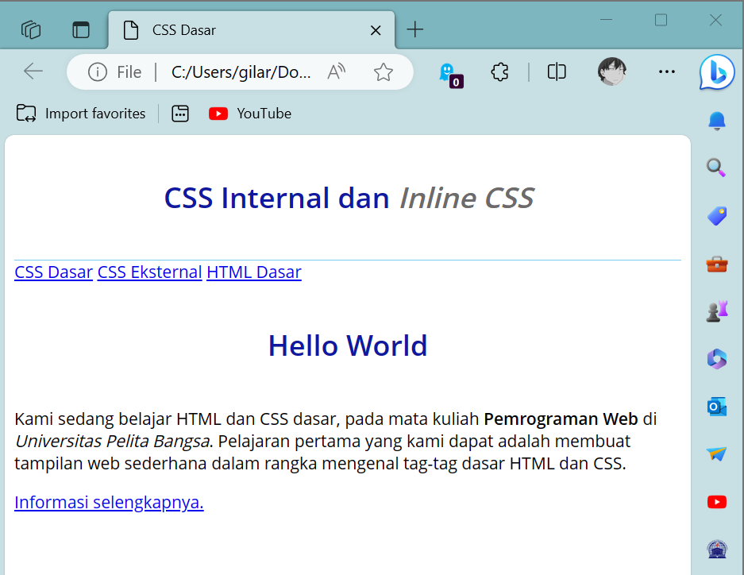
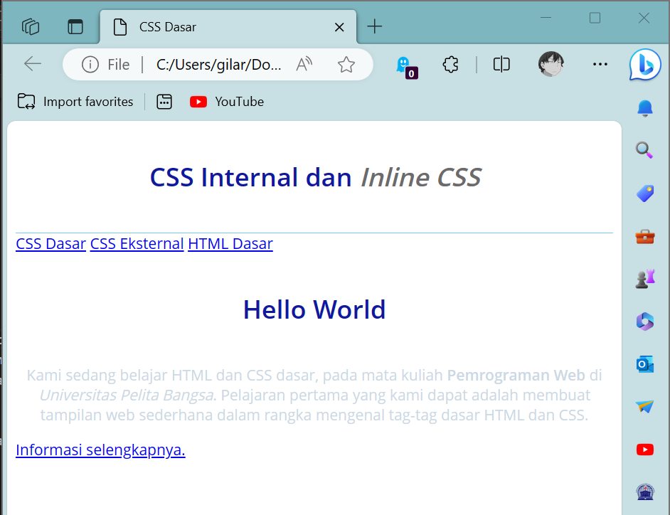
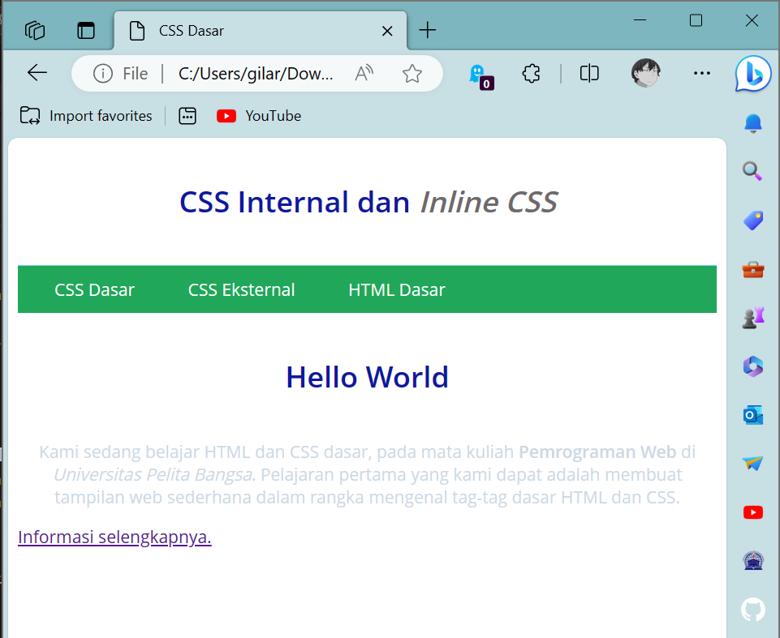
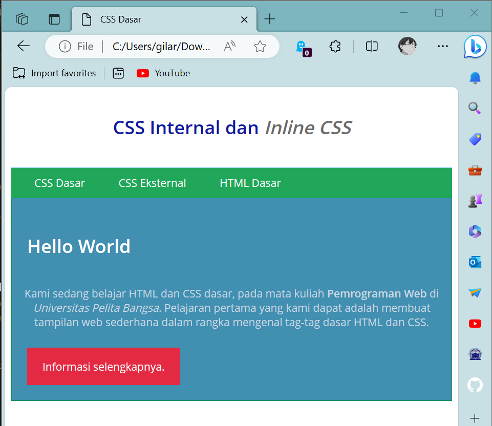

# CSS Dasar
## Profil
| Variable | Isi |
| -------- | --- |
| **Nama** | Gilar Sumilar |
| **NIM** | 312210407 |
| **Kelas** | TI.22.A4 |
| **Mata Kuliah** | Pemrograman WEB |

### Tugas
1. Buatlah repository baru dengan nama Lab2Web.
2. Kerjakan semua latihan yang diberikan sesuai urutannya.
3. Screenshot setiap perubahannya.
4. Buatlah file README.md dan tuliskan penjelasan dari setiap langkah praktikum beserta
screenshotnya.
5. Commit hasilnya pada repository masing-masing.
6. Kirim URL repository pada e-learning ecampus

## 1. Membuat dokumen HTML
```HTML
<!DOCTYPE html>
<html lang="en">
<head>
<meta charset="UTF-8">
<meta name="viewport" content="width=device-width, initial-scale=1.0">
<title>CSS Dasar</title>
</head>
<body>
<header>
<h1>CSS Internal dan <i>Inline CSS</i></h1>
</header>
<nav>
<a href="lab2_css_dasar.html">CSS Dasar</a>
<a href="lab2_css_eksternal.html">CSS Eksternal</a>
<a href="lab1_tag_dasar.html">HTML Dasar</a>
</nav>
<!-- CSS ID Selector -->
<div id="intro">
<h1>Hello World</h1>
<p>Kami sedang belajar HTML dan CSS dasar, pada mata kuliah <b>Pemrograman
Web</b> di <i>Universitas Pelita Bangsa</i>. Pelajaran pertama yang kami dapat
adalah membuat tampilan web sederhana dalam rangka mengenal tag-tag dasar HTML
dan CSS.</p>
<!-- CSS Class Selector -->
<a class="button btn-primary" href="#intro">Informasi selengkapnya.</a>
</div>
</body>
</html>
```
**Hasil :**



#### *Note :*


## 2. Mendeklarasikan CSS internal
```CSS
<head>
<title>CSS Dasar</title>
<style>
body {
font-family:'Open Sans', sans-serif;
}
header {
min-height: 80px;
border-bottom:1px solid #77CCEF;
}
h1 {
font-size: 24px;
color: #0F189F;
text-align: center;
padding: 20px 10px;
}
h1 i {
color:#6d6a6b;
}
</style>
</head>
```
**Hasil :**



#### *Note :*
- Letakan sourcecode di atas pada bagian `<head></head>` 
- Pada bagian garis berwarna biru di atas link adalah header


## 3. Menambahkan Inline CSS
```CSS
<p style="text-align: center; color: #ccd8e4;">
```
**Hasil :**



#### *Note :*
- Tambahkan deklarasi inline CSS pada tag `<p>` seperti berikut
- Menggeser paragraf menjadi `text-align` dengan warna abu2


## 4. Membuat CSS External
```CSS
nav {
background: #20A759;
color:#fff;
padding: 10px;
}
nav a {
color: #fff;
text-decoration: none;
padding:10px 20px;
}
nav .active,
nav a:hover {
background: #0B6B3A;
}
```
**Hasil :**



#### *Note :*
- Buat file baru dengan namac`style_external.css`
- tambahkan tag `<link>` untuk merujuk file css yang sudah dibuat pada bagian `<head>`
```CSS
<head>
<!-- menyisipkan css eksternal -->
<link rel="stylesheet" href="style_eksternal.css" type="text/css">
</head>
```

## 5. Menambahkan CSS selector
```CSS
/* ID Selector */
#intro {
background: #418fb1;
border: 1px solid #099249;
min-height: 100px;
padding: 10px;
}
#intro h1 {
text-align: left;
border: 0;
color: #fff;
}
/* Class Selector */
.button {
padding: 15px 20px;
background: #bebcbd;
color: #fff;
display: inline-block;
margin: 10px;
text-decoration: none;
}
.btn-primary {
background: #E42A42;
}
```
**Hasil :**



#### *Note :*
- Gambar hasil akhir
- Selanjutnya menambahkan CSS Selector menggunakan ID dan Class Selector. 
- Pada file `style_eksternal.css` letakan sourcecode di bawah navbar.

### Ini adalah sourcecode yang saya buat dengan beberapa perubahan 

#### HTML
```HTML
<!DOCTYPE html>
<html lang="en">

<head>
    <meta charset="UTF-8">
    <meta name="viewport" content="width=device-width, initial-scale=1.0">
    <!-- menyisipkan css eksternal -->
    <link rel="stylesheet" href="style_eksternal.css" type="text/css">
    <title>CSS Dasar</title>
    
    <style>
        body {
        font-family:'Open Sans', sans-serif;
        }
        header {
        min-height: 80px;
        border-bottom:1px solid #77CCEF;
        }
        h1 {
        font-size: 24px;
        color: #0F189F;
        text-align: center;
        padding: 20px 10px;
        }
        h1 i {
        color:#6d6a6b;
        }
        </style>
</head>

<body>
    <header>
        <h1>CSS Internal dan <i>Inline CSS</i></h1>
    </header>
    <nav>
        <a href="lab2_css_dasar.html">CSS Dasar</a>
        <a href="lab2_css_eksternal.html">CSS Eksternal</a>
        <a href="lab1_tag_dasar.html">HTML Dasar</a>
    </nav>
    <!-- CSS ID Selector -->
    <div id="intro">
        <h1>Hello World</h1>
        <p style="text-align: center; color: #ccd8e4;">Kami sedang belajar HTML dan CSS dasar, pada mata kuliah <b>Pemrograman
           Web</b> di <i>Universitas Pelita Bangsa</i>. Pelajaran pertama yang kami dapat
           adalah membuat tampilan web sederhana dalam rangka mengenal tag-tag dasar HTML
           dan CSS.</p>
        <!-- CSS Class Selector -->
        <a class="button btn-primary" href="#intro">Informasi selengkapnya.</a>
    </div>
</body>

</html>
```

#### CSS
```CSS
/* Navbar */
nav {
    background: #20A759;
    color:#fff;
    padding: 10px;
    }
nav a {
    color: #fff;
    text-decoration: none;
    padding:10px 20px;
    }
nav .active, nav a:hover {
    background: #0B6B3A;
    }


/* ID Selector */
#intro {
    background: #418fb1;
    border: 1px solid #099249;
    min-height: 100px;
    padding: 10px;
}

#intro h1 {
    text-align: left;
    border: 0;
    color: #fff;
}

/* Class Selector */
.button {
    padding: 15px 20px;
    background: #E42A42;
    color: #fff;
    display: inline-block;
    margin: 10px;
    text-decoration: none;
}

.btn-primary:hover {
    background: #a50a1f;
}
```

#### *Note :*
- Sedikit mengubah pada bagian `informasi selengkapnya` saya buat menjadi `hover`.

## Pertanyaan dan Tugas
1. Lakukan eksperimen dengan mengubah dan menambah properti dan nilai pada kode CSS
dengan mengacu pada CSS Cheat Sheet yang diberikan pada file terpisah dari modul ini.

2. Apa perbedaan pendeklarasian CSS elemen h1 {...} dengan #intro h1 {...}? berikan penjelasannya!

3. Apabila ada deklarasi CSS secara internal, lalu ditambahkan CSS eksternal dan inline CSS pada
elemen yang sama. Deklarasi manakah yang akan ditampilkan pada browser? Berikan penjelasan dan contohnya!

4. Pada sebuah elemen HTML terdapat ID dan Class, apabila masing-masing selector tersebut
terdapat deklarasi CSS, maka deklarasi manakah yang akan ditampilkan pada browser?
Berikan penjelasan dan contohnya! `<p id="paragraf-1" class="text-paragraf">`

## Jawaban
1.

2. `h1 {...}:`
    Ini adalah sebuah selektor CSS umum yang akan mempengaruhi semua elemen `<h1>` di halaman HTML.
    Dalam hal ini, gaya yang didefinisikan akan berlaku untuk setiap elemen `<h1>` di seluruh halaman.

   `#intro h1 {...}:`
    Ini adalah selektor CSS yang lebih spesifik dan berlaku hanya untuk elemen `<h1>` yang berada di dalam elemen dengan ID intro.
    Dalam hal ini, gaya yang didefinisikan hanya akan mempengaruhi elemen `<h1>` yang merupakan turunan dari elemen dengan ID intro.
   
    Dalam kedua kasus di atas, h1 dan `#intro h1` adalah selektor CSS yang mengacu pada elemen `<h1>`. 
    Namun, perbedaannya terletak pada ruang lingkup elemen yang dipengaruhi oleh gaya yang didefinisikan. 
    `h1 {...}` akan mempengaruhi semua elemen `<h1>` di halaman, sedangkan `#intro h1 {...}` akan mempengaruhi hanya elemen `<h1>` yang berada di dalam elemen dengan ID intro.

3. Urutan penulisan berperan ketika spesifisitasnya sama. Spesifisitas diukur berdasarkan kombinasi dari selektor CSS yang digunakan. Semakin spesifik selektor, semakin tinggi              spesifisitasnya.
   Umumnya, urutan prioritas adalah sebagai berikut (dari yang paling rendah ke yang paling tinggi):

    - 1). Deklarasi CSS dari file eksternal.
    - 2). Deklarasi CSS yang ada secara internal.
    - 3). Deklarasi inline CSS.

4. - Deklarasi CSS menggunakan ID memiliki keutamaan lebih tinggi daripada deklarasi CSS menggunakan class.
   - Ketika ada konflik, deklarasi CSS dengan ID akan menggantikan deklarasi CSS dengan class.
  
     CONTOH :
     Misalkan ada dekralasi CSS sebagai berikut.
     ```CSS
     #paragraf-1 {
     color: red;
     font-weight: bold;
     }

     .text-paragraf {
     color: blue;
     }
     ```

     Dan element HTML seperti ini.
     ```HTML
     <p id="paragraf-1" class="text-paragraf">Contoh paragraf</p>
     ```
     
     Dalam contoh di atas, meskipun elemen `<p>` memiliki class `"text-paragraf"`, deklarasi CSS dengan ID `#paragraf-1` akan mendominasi dan mengaturnya menjadi teks berwarna merah dan      tebal (sesuai dengan deklarasi di atas). Deklarasi `color: blue;` dari class akan diabaikan dalam hal ini.
     Jadi, deklarasi dengan ID memiliki prioritas lebih tinggi daripada deklarasi dengan class dalam menentukan gaya elemen.
